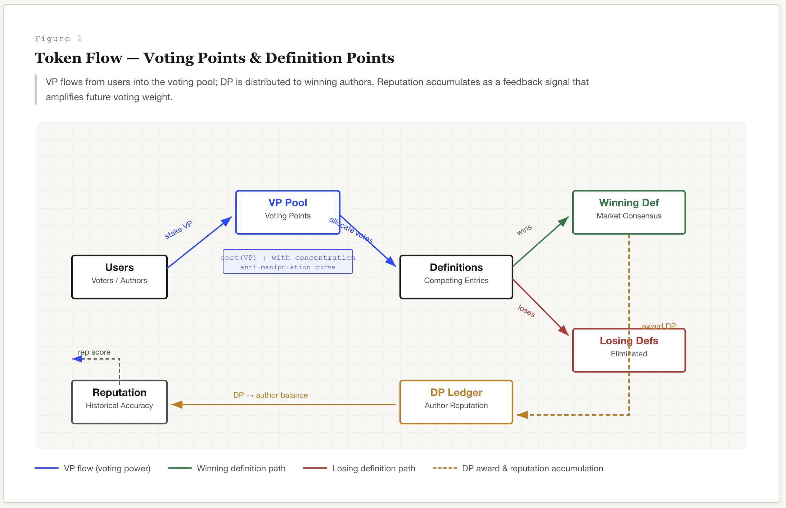
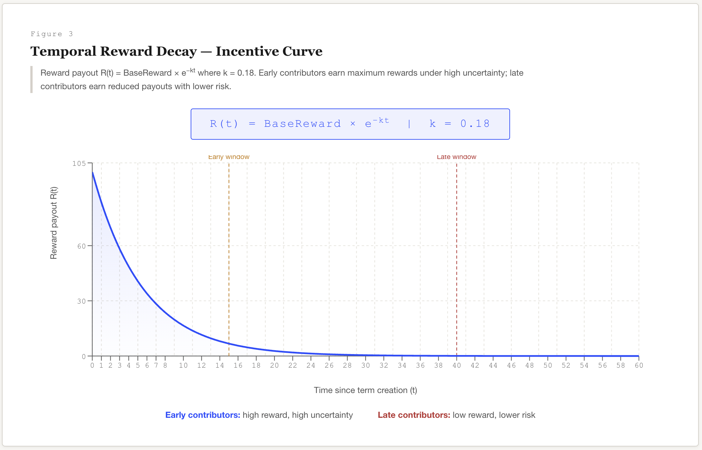
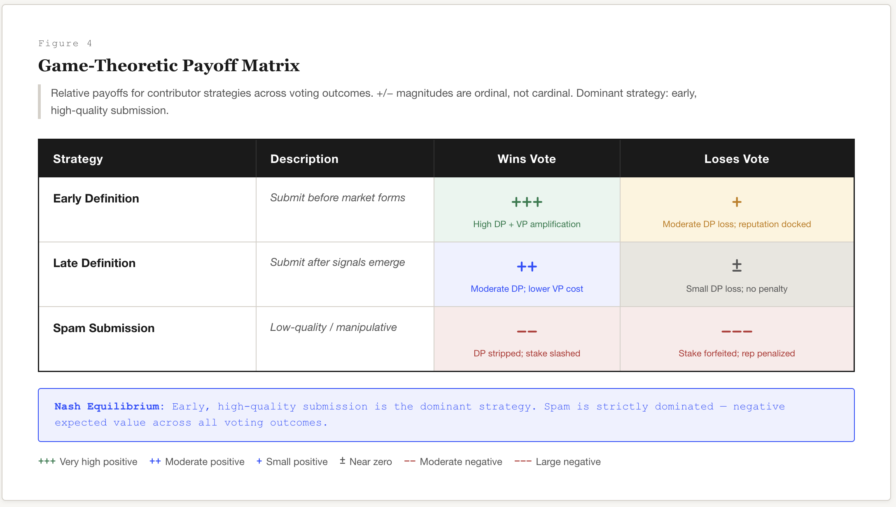

# Decentralized Semantic Markets (DSM)

### A Market Mechanism for Incentivized Discovery of Language

This work introduces the concept of Decentralized Semantic Markets.

**Original Author:** Sypher
**Date:** 2026

---

## Abstract

Language evolves continuously through cultural interaction, technological innovation, and social coordination. Traditional dictionaries are centralized editorial systems that update slowly and struggle to capture emerging terminology in real time.

This paper proposes a decentralized mechanism for discovering, curating, and validating definitions of terms through an incentive-driven marketplace. Participants submit definitions for terms and vote on competing interpretations using a tokenized reputation and staking mechanism.

The system rewards early discovery of new terminology, accurate interpretation of evolving meaning, and effective curation of high-quality definitions.

We call this mechanism a **Decentralized Semantic Market (DSM)** — a market-based approach to collectively discovering the meaning of language.

---

## 1. Introduction

Language is a dynamic coordination system. New words and meanings emerge constantly across internet culture, finance, gaming, science, and social media.

Traditional dictionaries update slowly because they rely on centralized editorial processes and manual review. Crowdsourced dictionaries improve coverage but often suffer from manipulation, spam entries, and weak incentives for quality contributions.

A decentralized semantic market introduces economic incentives that encourage participants to compete in discovering and curating high-quality definitions.

Instead of editorial committees deciding meaning, definitions compete in a marketplace where collective voting determines semantic consensus.

---

## 2. Core Concept

The system functions as a semantic discovery market.

Participants interact through two primary activities:

1. **Definition creation** — proposing candidate meanings for terms.
2. **Definition curation** — voting on competing interpretations.

Definitions compete for dominance within a term. Participants allocate voting power toward the definitions they believe best represent the meaning of the term.

Rewards are distributed based on the collective outcome of the market.

---

## 3. System Architecture



### 3.1 Terms

A **term** represents a unit of language — a word, phrase, or expression whose meaning is contested, emerging, or evolving.

Examples:
- *rugpull*
- *alpha*
- *doomscrolling*
- *simp*

Each term acts as a container for multiple competing definitions.

### 3.2 Definitions

Participants may submit definitions for a term. Each definition contains:

- Textual definition
- Optional example usage
- Timestamp
- Submitting address

Definitions enter a voting period during which participants allocate voting points.

### 3.3 Voting Points (VP)

Voting Points represent curation power. Participants allocate VP to definitions they believe best represent a term.

VP may be obtained through:

- Initial allocation
- Purchase (subject to convex cost curves)
- Rewards for accurate voting

Voting power may increase or decrease based on historical accuracy.

### 3.4 Definition Points (DP)

Definition Points represent reputation earned by contributors whose definitions win the voting process. DP accumulates over time and signals a contributor's influence within the semantic network.

---

## 4. Incentive Structure

The system rewards three behaviors:

**Discovery** — Users who identify emerging terminology early are rewarded with maximum payouts under the temporal decay function.

**Interpretation** — Users who write high-quality definitions receive rewards if the market adopts their interpretation.

**Curation** — Users who accurately vote on definitions gain voting power and reputation, amplifying their future influence.

---

## 5. Anti-Manipulation Mechanisms

### Voting Cost Curves

The cost of acquiring additional voting points follows a convex pricing function, discouraging excessive concentration of influence:

```
Cost(VP) = a × VP^b       where b > 1
```

### Reputation Weighting

Votes are weighted by historical accuracy. Participants who consistently vote with the market outcome gain greater voting influence:

```
VoteWeight(i) = VP(i) × log(1 + Rep(i))
```

### Term Creation Staking

Creating a new term requires staking voting points. If the term fails to gain adoption, the stake may be forfeited.

---

## 6. Temporal Reward Decay



Definition rewards decrease as the voting window progresses. Early contributors receive higher rewards but face greater uncertainty. Late contributors receive lower rewards but benefit from existing information.

This produces a risk-reward curve that encourages early discovery.

**Reward Function:**

```
R(t) = R₀ × e^(−k × t)
```

| Parameter | Description |
|-----------|-------------|
| `R₀` | Base reward per term |
| `k` | Decay constant controlling reward decline |
| `t` | Time since term creation |

**Half-life** of the reward: `t_half = ln(2) / k`

Early entrants face maximum uncertainty but capture exponentially higher payouts. Late entrants benefit from informational signals but earn diminished returns.

---

## 7. Token Flow Architecture


The semantic market operates through two primary token flows:

1. **Voting Points (VP)** — staked by users to vote on definitions.
2. **Definition Points (DP)** — awarded to authors of winning definitions.

Users stake VP to vote on definitions. Winning definitions receive DP rewards, which accumulate as non-transferable reputation. Higher reputation increases future voting weight through the logarithmic amplification function.

### VP Supply Control

To prevent concentration of power, VP acquisition follows a nonlinear cost curve:

```
Cost(VP) = a × VP^b
```

| Parameter | Description | Suggested Value |
|-----------|-------------|:---:|
| `a` | Base cost coefficient | 0.01 |
| `b` | Convexity exponent (b > 1) | 1.5 |

**Marginal cost** of the *n*-th VP unit: `MC(n) = a × b × n^(b−1)`

This ensures marginal voting power becomes increasingly expensive, making it economically prohibitive for any single actor to dominate.

### DP Reputation Model

DP acts as a non-transferable reputation score:

```
Rep(i) = Σ DP(i, t)
```

Vote weight is adjusted by reputation:

```
VoteWeight(i) = VP(i) × log(1 + Rep(i))
```

The logarithmic function ensures diminishing returns on reputation, preventing permanent oligarchic control while still rewarding historically accurate contributors.

---

## 8. Game-Theoretic Incentives



Contributor strategies produce different payoff outcomes depending on voting results. The system is designed such that early, high-quality submissions become the dominant strategy.

Low-quality or spam submissions produce negative expected value due to staking losses and reputation penalties.

---

## 9. Formal Mechanism Design

The DSM can be modeled as a coordination game among participants attempting to identify the most accurate definition of a term.

### 9.1 Game Definition

A Decentralized Semantic Market is a tuple **Γ = (N, S, u, T, τ)** where:

- **N = {1, 2, ..., n}** — the set of players (participants).
- **S = S^D × S^V** — the strategy space:
  - **S^D** — submit a definition or abstain.
  - **S^V** — an allocation of voting points across definitions, subject to VP budget constraint.
- **u(i) : S → ℝ** — the payoff function for player *i*.
- **T** — the voting window duration.
- **τ ∈ [0, T]** — current time within the window.

### 9.2 Payoff Functions

Let **d\*** denote the winning definition — the definition receiving the greatest total weighted vote at τ = T.

**Author payoff** for player *i* submitting definition *d(i)* at time *τ(i)*:

```
u_author(i) =
  R₀ × e^(−k × τᵢ) + ΔDP(i)       if d(i) = d*
  −C_stake − δ × Rep(i)             if d(i) ≠ d*
```

**Voter payoff** for player *i* allocating *v(i,j)* VP to definition *d(j)*:

```
u_voter(i) = Σⱼ v(i,j) ×
  α × log(1 + Rep(i))       if d(j) = d*
  −β                         if d(j) ≠ d*
```

### 9.3 Nash Equilibrium

The equilibrium strategy is: **submit a high-quality definition early and vote honestly.**

Spam submissions or collusive voting produce negative expected payoff due to:

- Staking penalties
- Reputation loss
- Diminishing reward curves

**Expected payoff by strategy:**

| Strategy | Expected Payoff |
|----------|----------------|
| Early definition | `E[u] = p_e × R₀ − (1−p_e)(C_stake + δ × Rep)` |
| Late definition | `E[u] = p_l × R₀ × e^(−kT) − (1−p_l)(C_stake + δ × Rep)` |
| Spam submission | `E[u] ≈ −C_stake − δ × Rep − γ × Rep < 0` |

Early submission dominates: the reward multiplier `e^(−kτ) ≈ 1` at `τ → 0` outweighs the moderate win probability `p_e`, producing the highest expected value.

### 9.4 Voting Equilibrium

The weighted vote total for definition *d(j)*:

```
W(j) = Σᵢ v(i,j) × log(1 + Rep(i))
```

The winning definition: **d\* = argmax W(j)**

Rational voters coordinate on the definition with the highest perceived quality, creating a Schelling focal point. Voters earn positive returns only for backing the eventual winner, driving self-reinforcing convergence.

### 9.5 Anti-Collusion Properties

Collusion becomes costly due to:

- **Convex VP cost curves** — acquiring influence scales superlinearly.
- **Slashing mechanisms** — failed votes forfeit staked VP.
- **Reputation decay** — inaccurate voting erodes future influence.

**Collusion cost** for a group C:

```
CollCost(C) = Σᵢ∈C [a × VP(i)^b] + (1−π_c) × Σᵢ∈C [β × VP(i)]
```

**Collusion threshold** — collusion is unprofitable when:

```
Σᵢ∈C [a × VP(i)^b] > π_c × R₀ × e^(−kτ̄)
```

Since VP cost grows convexly while rewards decay exponentially, there exists a finite group size **|C\*|** beyond which collusion is strictly dominated. For reasonable parameters, this threshold is small enough to prevent meaningful coordination attacks.

---

## 10. Token Economy Model

### 10.1 VP Issuance and Acquisition

Each participant receives an initial VP allocation:

```
VP_init(i) = V₀
```

Additional VP is earned through accurate voting:

```
VP_earned(i) = η × Σ [correct_votes(i,t) × log(1 + Rep(i,t))]
```

VP purchase cost schedule (a = 0.01, b = 1.5):

| VP Purchased | Total Cost | Marginal Cost |
|:---:|:---:|:---:|
| 10 | 0.316 | 0.047 |
| 100 | 10.00 | 0.150 |
| 1,000 | 316.2 | 0.474 |
| 10,000 | 10,000 | 1.500 |

### 10.2 Equilibrium Voting Behavior

Rational participants maximize expected return by voting for the definition most likely to win the final consensus.

This transforms the system into a **prediction market on semantic meaning** — participants are effectively betting on which interpretation the collective will adopt.

---

## 11. Potential Use Cases

**Internet Slang Dictionary** — A continuously evolving dictionary for online culture, driven by economic incentives rather than editorial discretion.

**AI Training Data** — Language models require constantly evolving datasets reflecting new terminology. DSM produces curated, consensus-validated definitions suitable for training data pipelines.

**Cultural Trend Detection** — Tracking emerging terminology reveals trends across technology, finance, politics, and internet culture. Early term creation signals can serve as leading indicators.

**Semantic Knowledge Graphs** — Terms and definitions form a decentralized semantic graph usable by AI systems, search engines, and knowledge bases.

---

## 12. Future Extensions

- Prediction markets on semantic outcomes
- Cross-language semantic markets
- AI-assisted definition proposals
- Decentralized ontology graphs
- Governance mechanisms for parameter tuning (k, a, b, δ)

---

## 13. Conclusion

Language evolves through decentralized human interaction.

A decentralized semantic market introduces incentive structures that accelerate the discovery and validation of new terminology. By transforming semantic interpretation into a competitive marketplace, meaning can emerge dynamically through collective intelligence and economic incentives.

The formal mechanism design demonstrates that honest participation is the dominant strategy — early, high-quality definitions maximize expected payoff while spam and collusion are economically infeasible under the convex cost and temporal decay functions.

DSM represents a new primitive: **a market where the traded asset is meaning itself.**

---

*For the full LaTeX formalization of the mechanism design proofs, see [`math/formal-model.tex`](../math/formal-model.tex).*

*For the complete tokenomics model with parameter tables, see [`tokenomics/vp-dp-model.md`](../tokenomics/vp-dp-model.md).*
